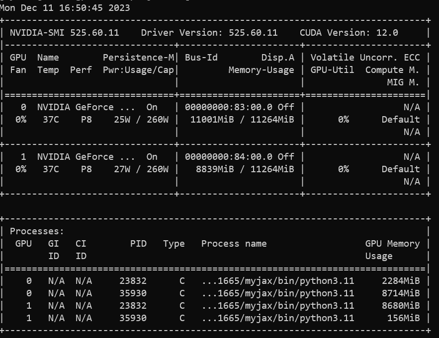

# gpu-final-project-ds 

# Project #8: Data Structure Library for GPUs: Graphs

## 1. Introduction
This project creates a data structure using CUDA with C++ to store a graph. The graph can be directed and is able to record weight for each edge. We provide two version of the data stucture, a CPU version (host) and a GPU version (device). Both versions use coordinate list (COO) method to store the adjacent matrix of the graph, which can save a lot of space when the graph is sparce. The CPU version stores all the information of the graph on the host and do all the operations sequentially on the host, while the GPU version stores the coordinate list on the device and accerlate operations through parallelization. Through testing, we find that, when the graph is big, the GPU version runs much faster for operations that have to traverse the whole coordinate list.

## 2. Files Details
 - README.md - give an introduction to this repository
 - graph.hxx - head file storing the definition of the class graph, 
 - coo.hxx - head file storing the definition of the class coo, the GPU version of the data structure
 - coo_h.hxx - head file storing the definition of the class coo_h, the CPU version of the data structure
 - test.cu - cuda code to test whether the GPU version runs correctly on a very small graph
 - compare.cu - cuda code to check whether the GPU version and the CPU give the same result for same operations
 - exp.cu - cuda code to run the data structure and measure the time
 - some_is_sleeping_on_cuda2.jpg - someone has occupied the memory of the GPU on server cuda2 and not used the computation resources for more than 2 days. As a result, we can not use the cuda2 to test our data structure
 - person_sleeping_on_cuda2.png - the name of the process that occupies cuda2 and does nothing

## 3. Evironment Setting
Our code could be compiled with cuda-11.4 and gcc-4.8.5 and could be run correctly on the NYU cims server - cuda1, cuda3, cuda4 and, cuda5. We could not test our code on cuda2 because someone have occupied the memory of the GPU on cuda2 and not used the computation resources for more than 2 days.

## 2. Project report link
[report link](https://www.overleaf.com/5446618226vkrkpmmqqckf#965552)

## 3. To do

### Todo

- [x] Finish header file for GPU version
- [x] Fill the gap 
- [x] Finish the CPU version
- [x] Evaluate the correctness
- [x] Compare performance of GPU and CPU version
- [ ] Finish README
- [ ] Finish final report

## 4. DDL
12.13 to submit report, code and readme.md

## 5. Team Member
 - Shidong Zhang
 - Baijia Ye
 - Ziyue Feng
 - Changyue Su
